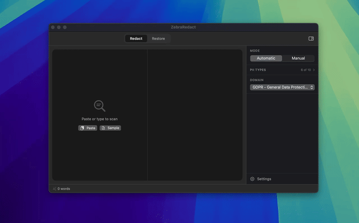

# ZebraRedact

**Redact before you send. Restore when you're done.**



A native macOS app that replaces sensitive data with reversible privacy tokens before it reaches any AI service. Detection runs entirely on-device using built-in macOS APIs — no third-party libraries, no cloud calls, no data leaves your machine.

```
Before  →  Write an offer email to James Okonkwo
            (j.okonkwo@gmail.com, (646) 555-0193). He's currently a
            senior engineer at Stripe (4 years) and has a competing
            offer from Notion at $158k. We're at $165k + 0.3% equity,
            start March 10. His recruiter was Sarah Park. He asked
            about remote policy and visa sponsorship — confirm both
            are covered. He seemed genuinely excited — keep it warm.

After   →  Write an offer email to [NAME_A1B2]
            ([EMAIL_C3D4], [PHONE_E5F6]). He's currently a
            senior engineer at [ORG_G7H8] (4 years) and has a competing
            offer from [ORG_I9J0] at $158k. We're at $165k + 0.3% equity,
            start March 10. His recruiter was [NAME_J1K2]. He asked
            about remote policy and visa sponsorship — confirm both
            are covered. He seemed genuinely excited — keep it warm.
```

Paste the redacted version into any AI assistant. When the response comes back, use the **Restore** tab to swap every token back to the original value.

---

## The Problem

Pasting sensitive data into AI assistants is a data-leak risk — not because the AI gives a bad answer, but because the text leaves your device and reaches a third-party server. Patient records, employee files, client contracts, financial data: all of it is subject to logging, training, and storage policies you don't control.

Manually sanitizing text before every prompt is too slow to be practical, and simply deleting sensitive values breaks the AI's ability to give useful answers. You need a tool that removes the data *without* removing the context.

ZebraRedact replaces sensitive values with structured, reversible tokens. The AI sees the full shape of your request. None of the real data crosses the wire.

---

## How It Works

1. **Paste your text** — ZebraRedact scans it instantly and replaces names, emails, phone numbers, SSNs, credit card numbers, and more with typed tokens like `[NAME_A1B2]` or `[EMAIL_C3D4]`.

2. **Send to AI** — Copy the redacted text or use the one-click Send button to open ChatGPT, Claude, Perplexity, or Grok and auto-paste. The AI receives tokens, not real data.

3. **Restore** — Paste the AI's response (tokens and all) into the **Restore** tab. ZebraRedact rehydrates every token back to its original value inline.

**Why tokens instead of deletion?** Tokens preserve the structure the AI needs to give a useful answer — while keeping the real values on your device. The same entity always gets the same token across the document, so references stay consistent.

---

## Privacy

Detection uses Apple's built-in NLTagger framework and local regex patterns — the same on-device NLP that powers Siri and Spotlight. ZebraRedact makes zero network calls of its own. Your original text never leaves the app.

- **No third-party dependencies** — detection is pure macOS, no external SDKs
- **No network calls** — ZebraRedact sends nothing, anywhere
- **Session-only memory** — token mappings live in RAM and are discarded when you quit
- **`NSPrivacyTracking: false`** — no tracking, no analytics, no collected data types

When you use the Send button to open ChatGPT, Claude, or another AI service, only the already-redacted text (tokens, not originals) is sent.

---

## Download

[**Download ZebraRedact →**](https://github.com/jacopom/zebraredact/releases/latest)

**Requires macOS 15.0+**

### Install (unsigned build)

1. Open the `.dmg` and drag **ZebraRedact** to your Applications folder.
2. First launch: macOS will block it with an "unverified developer" warning.
3. Go to **System Settings → Privacy & Security** → scroll down → click **Open Anyway**.

Or from Terminal:
```bash
xattr -rd com.apple.quarantine /Applications/ZebraRedact.app
```

---

## Build from Source

**Requirements:** macOS 15.0+, Xcode 16+

```bash
# Debug build
DEVELOPER_DIR=/Applications/Xcode.app/Contents/Developer \
  xcodebuild -project ZebraRedact.xcodeproj -scheme ZebraRedact \
  -configuration Debug build

# Release archive
DEVELOPER_DIR=/Applications/Xcode.app/Contents/Developer \
  xcodebuild -project ZebraRedact.xcodeproj -scheme ZebraRedact \
  -configuration Release archive -archivePath build/ZebraRedact.xcarchive
```

### Project layout

```
ZebraRedact/
├── ZebraRedact/
│   ├── App/
│   │   ├── ZebraRedactApp.swift        # @main, WindowGroup, Settings scene
│   │   └── AppDelegate.swift           # NSStatusItem, hotkey, onboarding
│   ├── Models/
│   │   ├── PIIItem.swift               # PII data model + token alternatives
│   │   └── PIIType.swift               # Enum of detectable PII categories
│   ├── Services/
│   │   ├── PIIDetector.swift           # Detection orchestrator + masking pipeline
│   │   ├── NLTaggerDetector.swift      # Apple NLP
│   │   ├── RegexDetector.swift         # Pattern-based detection
│   │   └── TokenMappingStore.swift     # Token ↔ original mapping (rehydration)
│   ├── Views/
│   │   ├── Onboarding/OnboardingView.swift
│   │   └── Settings/SettingsView.swift
│   └── Utilities/
│       ├── DesignSystem.swift          # Colors, typography, spacing
│       └── Constants.swift
│
└── (root — compiled into target)
    ├── MainWindow.swift                # Main UI: top bar, twin panels, sidebar, bottom bar
    └── ClickableTokenTextView.swift    # NSTextView with spoiler overlay + right-click tagging
```

---

## License

Copyright 2025 ZebraRedact. All rights reserved.
